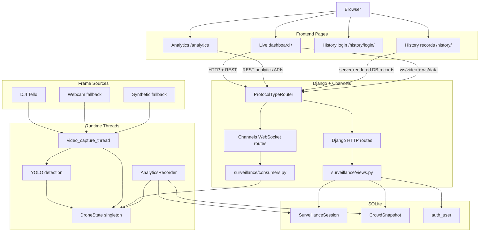

# DroneWatch Deep System Workflow

This document describes how the current DroneWatch system runs end to end:
startup, video capture, AI detection, startup-person memory, live dashboard
telemetry, persistence, analytics, and the custom history records page.

The application is the Django + Channels project in `dronewatch/`.
Legacy standalone FastAPI/dashboard experiment paths were removed so the repo
tracks only the maintained Django runtime.

---

## 1. Project Map

```text
humanDetect/
|-- dronewatch/                         Current Django application
|   |-- manage.py                       Django command entry point
|   |-- db.sqlite3                      SQLite database
|   |-- dronewatch/
|   |   |-- settings.py                 Django, auth, admin, Channels, SQLite
|   |   |-- urls.py                     Root routes, including /admin/
|   |   |-- asgi.py                     HTTP/WebSocket protocol router
|   |-- surveillance/
|       |-- apps.py                     Runtime startup hook
|       |-- admin.py                    Django admin model registration
|       |-- analytics.py                Snapshot recorder and report builder
|       |-- consumers.py                WebSocket video/data streams
|       |-- detection.py                YOLO detection and startup memory
|       |-- drone_state.py              Shared runtime state singleton
|       |-- models.py                   SurveillanceSession and CrowdSnapshot
|       |-- routing.py                  WebSocket URL routes
|       |-- urls.py                     App HTTP routes
|       |-- video_thread.py             Capture + detection loop
|       |-- views.py                    Pages, login, REST APIs
|       |-- templates/surveillance/
|       |   |-- index.html              Live dashboard
|       |   |-- analytics.html          Analytics report page
|       |   |-- history.html            Custom past-records page
|       |   |-- history_login.html      Custom superuser login
|       |-- static/surveillance/
|           |-- app.js                  Live dashboard client
|           |-- analytics.js            Analytics client
|           |-- history.css             Custom history styling
|           |-- style.css               Shared dashboard styling
|           |-- vendor/                 Local fonts and Chart.js
|
|-- models/
|   |-- person_detection/               YOLOv4 person model
|   |-- weapon_detection/               YOLOv3 weapon model
|   |-- fire_detection/                 YOLOv4-tiny fire model
|
|-- requirements.txt                    Python dependencies
```

---

## 2. Runtime Stack

| Layer | Technology | Main files | Responsibility |
| --- | --- | --- | --- |
| HTTP app | Django | `views.py`, `urls.py` | Pages, login, APIs, drone commands |
| WebSocket app | Django Channels | `routing.py`, `consumers.py` | Live video frames and telemetry |
| ASGI server | Daphne/runserver | `asgi.py`, `manage.py` | HTTP + WebSocket entry point |
| Video source | DJI Tello / webcam / synthetic | `video_thread.py` | Continuously produce frames |
| AI detection | OpenCV DNN + YOLO | `detection.py` | Human, weapon, fire detection |
| Shared memory | Python singleton | `drone_state.py` | Runtime counts, alerts, frames, metrics |
| Persistence | Django ORM + SQLite | `models.py`, `analytics.py` | Sessions and snapshot history |
| Frontend | HTML/CSS/JS + Chart.js | `templates/`, `static/` | Dashboard, analytics, history |
| Access control | Django auth | `settings.py`, `views.py` | Custom history login and admin auth |

---

## 3. High-Level Architecture



---

## 4. Startup Commands

From a bash-style shell in this workspace:

```bash
cd /w/humanDetect/dronewatch
python manage.py migrate
python manage.py runserver
```

If the shell is PowerShell instead:

```powershell
cd W:\humanDetect\dronewatch
python manage.py migrate
python manage.py runserver
```

Important pages:

| Page | URL | Purpose |
| --- | --- | --- |
| Live dashboard | `/` | Video, counts, alerts, drone controls |
| Analytics | `/analytics` | Charts and report view |
| Custom history | `/history/` | Past project-run records |
| History login | `/history/login/` | Superuser login for history |
| Django admin | `/admin/` | Default Django admin fallback |

The app auto-prepares a development superuser during server startup:

```text
username: shiv
password: 8449
```

This only succeeds after auth migrations have been applied.

---

## 5. Django Startup Chain

```text
manage.py
  -> sets DJANGO_SETTINGS_MODULE=dronewatch.settings
  -> Django loads settings.py
  -> app registry loads surveillance.apps.SurveillanceConfig
  -> SurveillanceConfig.ready() checks whether this is a runtime server
  -> load YOLO models
  -> ensure superuser shiv/8449 exists
  -> start video_capture_thread as daemon thread
  -> start AnalyticsRecorder 2 seconds later
  -> server accepts HTTP and WebSocket traffic
```

`SurveillanceConfig.ready()` skips expensive runtime work for management
commands such as:

```text
migrate, makemigrations, collectstatic, shell, test, createsuperuser,
check, showmigrations, dbshell, inspectdb, flush, loaddata, dumpdata
```

It starts the workload only for `runserver`, `daphne`, or `ASGI_SERVER=1`.

---

## 6. Settings and Auth

`dronewatch/settings.py` now includes the standard Django admin/auth/session
stack:

```text
django.contrib.admin
django.contrib.auth
django.contrib.contenttypes
django.contrib.sessions
django.contrib.messages
django.contrib.staticfiles
channels
surveillance
```

Middleware includes sessions, CSRF, authentication, messages, and clickjacking
protection. This is required for:

1. The custom `/history/login/` form.
2. Django session cookies.
3. The fallback `/admin/` page.
4. Superuser checks before showing history records.

---

## 7. Shared Runtime State

`surveillance/drone_state.py` defines one process-wide `DroneState` instance.
It is shared by the video thread, detection functions, WebSocket consumers,
analytics recorder, and REST views.

Important fields:

| Field | Meaning |
| --- | --- |
| `mode` | Active detection mode: `human`, `weapon`, or `fire` |
| `current_count` | Current non-startup people count |
| `cumulative_count` | Total non-startup unique people tracked |
| `tracked_people` | Current centroid tracker map |
| `tracked_people_ignored` | Whether a tracked ID is startup-memory ignored |
| `tracked_people_memory_slots` | Mapping from tracked ID to startup slot |
| `next_person_id` | Next normal person ID after startup memory fills |
| `startup_memory_limit` | Number of initial people to remember, currently 10 |
| `startup_people_seen` | Count of startup people consumed |
| `startup_people_signatures` | Stored visual signatures for startup people |
| `confidence_values` | Recent accepted YOLO confidences |
| `detection_accuracy` | Latest accepted detection confidence average, percent |
| `average_confidence` | Rolling confidence average over recent detections |
| `recent_detection_count` | Number of accepted detections in latest pass |
| `density_alert`, `weapon_alert`, `fire_alert` | Current alert flags |
| `alert_history` | Recent alert objects |
| `people_history` | Short in-memory chart history |
| `last_detection_boxes` | Boxes redrawn on skipped detection frames |
| `processed_frame` | Latest frame with overlays |

The in-memory histories feed the live dashboard. Long-term history is saved in
SQLite by the analytics recorder.

---

## 8. Video Capture Loop

`video_thread.video_capture_thread()` owns frame acquisition and detection.

Startup source selection:

1. If not in demo mode, try a DJI Tello connection with an 8 second timeout.
2. If Tello works, use `get_frame_read().frame` for video.
   A separate telemetry thread polls battery, height/TOF altitude, and temperature.
3. If Tello fails, switch to demo mode.
4. In demo mode, try webcams `0`, `1`, and `2`.
5. If no webcam opens, produce synthetic dark/noisy frames.

Per-frame loop:

```text
capture frame
resize to 960x720
save raw frame to state.frame
increment state.frame_counter
if frame_counter % DETECT_EVERY_N == 0:
    run detect_humans / detect_weapons / detect_fire
else:
    redraw cached detection boxes
update processed_frame
append in-memory chart history at DATA_FPS
calculate FPS
sleep to target WS_FPS
```

Detection is frame-skipped for performance. Human/fire modes run every third
frame, weapon mode runs every fourth frame, and skipped frames reuse the last
accepted boxes so overlays remain visible.

---

## 9. Model Loading

`detection.load_models()` loads three OpenCV DNN models:

| Mode | Config | Weights |
| --- | --- | --- |
| Human | `models/person_detection/yolov4.cfg` | `models/person_detection/yolov4.weights` |
| Weapon | YOLOv8n threat model | `models/weapon_detection/threat_yolov8n.pt` |
| Weapon fallback | `models/weapon_detection/yolov3_testing.cfg` | `models/weapon_detection/yolov3_training_2000.weights` |
| Fire | `models/fire_detection/yolov4-tiny_custom.cfg` | `models/fire_detection/yolov4-tiny_custom_last.weights` |

The output layer names are cached globally in `detection.py`.

If loading fails, the server can still start and stream frames, but detection
will not run correctly until model paths/dependencies are fixed.

---

## 10. Human Detection and Startup Memory

Human mode uses YOLOv4 person detections plus centroid tracking.

Basic detection path:

```text
frame -> blobFromImage(320x320)
personNet.forward()
for each detection:
    scores = detection[5:]
    class_id = argmax(scores)
    confidence = scores[class_id]
    keep only class_id == HUMAN_INDEX and confidence > 0.5
run NMSBoxes()
for each accepted box:
    compute centroid
    match against current tracked_people within 50 px
    otherwise assign startup-memory or normal ID
```

Startup memory behavior:

1. The first 10 unique startup people are not counted as new people.
2. For each startup person, the system builds a compact visual signature from
   the top portion of the person box.
3. Signatures use HSV histogram data plus a simple aspect-ratio check.
4. Startup people are drawn with a different color and labels like `START 01`.
5. After 10 startup people are consumed, new unmatched people receive normal
   IDs such as `ID 0`, `ID 1`, etc.
6. Normal IDs increment `cumulative_count`; startup people do not.

Why this exists:

During drone takeoff, the same nearby people are often visible at the start.
The startup memory prevents those people from being returned as new discoveries
later in the run.

Important limitation:

This is not full face recognition. It is a lightweight visual-signature memory
based on the detected person crop. Clothing, angle, lighting, blur, and distance
can affect matches.

---

## 11. Detection Accuracy and Confidence

The dashboard shows `Detection Accuracy`, but technically this value is model
confidence, not lab-measured accuracy.

Detection quality fields are updated by `_update_detection_quality()`:

| Field | Meaning |
| --- | --- |
| `detection_accuracy` | Average confidence of accepted detections in latest detection pass |
| `average_confidence` | Average confidence over recent `confidence_values` |
| `recent_detection_count` | Number of accepted boxes in latest detection pass |
| `confidence_values` | Recent raw confidence values for the chart |

True accuracy would require labeled ground-truth data. The current value answers
"how confident was the model about accepted detections?".

---

## 12. Weapon and Fire Detection

Weapon mode:

```text
weaponYolo.predict()
keep Gun, knife, and grenade classes at 640x640 input by default
use class-specific thresholds: gun/grenade 0.22, knife 0.10
optionally set WEAPON_YOLOV8_INPUT_SIZE=768 for sharper knife testing
fallback to legacy weaponNet.forward() if YOLOv8 is unavailable
run NMSBoxes() with a 0.35 NMS threshold
draw orange class-labeled WEAPON? labels for weak hits
draw red class-labeled WEAPON labels for stronger hits
state.weapon_alert = True after a strong hit or repeated weak hits
append confidence values
update detection quality
```

Fire mode:

```text
fireNet.forward()
keep detections with confidence > CONF_THRESHOLD, currently 0.2
run NMSBoxes()
draw orange FIRE label
state.fire_alert = True if any accepted detection exists
append confidence values
update detection quality
```

Alerts use a shared 3 second cooldown through `state.last_alert_time`.

---

## 13. Live Dashboard Data Flow

The live dashboard page is `templates/surveillance/index.html`.
Client logic is `static/surveillance/app.js`.

Browser connections:

| Socket/API | Source | Payload |
| --- | --- | --- |
| `ws://host/ws/video` | `VideoConsumer` | Base64 JPEG frames |
| `ws://host/ws/data` | `DataConsumer` | JSON telemetry |
| `GET /api/status` | `api_status` | Status, demo/live source, model state |
| `POST /api/mode/<mode>` | `api_set_mode` | Switch human/weapon/fire |
| `POST /api/drone/<cmd>` | `api_drone_control` | Send Tello movement commands |

Telemetry includes:

```json
{
  "mode": "human",
  "battery": 100,
  "altitude": 0,
  "fps": 20.0,
  "detection_accuracy": 87.4,
  "average_confidence": 84.1,
  "recent_detection_count": 2,
  "current_count": 1,
  "cumulative_count": 3,
  "startup_memory_count": 10,
  "startup_people_seen": 10,
  "startup_memory_limit": 10,
  "density_alert": false,
  "weapon_alert": false,
  "fire_alert": false,
  "people_history": [],
  "confidence_values": [],
  "alerts": [],
  "session_id": "uuid",
  "recording_active": true
}
```

Dashboard UI cards:

| Card | Data |
| --- | --- |
| Current People | `current_count` |
| Total Tracked | `cumulative_count` |
| Battery | `battery` |
| Altitude | `altitude` |
| Detection Accuracy | `detection_accuracy` |
| Startup Memory | `startup_people_seen/startup_memory_limit` |

---

## 14. HTTP Routes

Defined in `surveillance/urls.py`.

| Method | Path | View | Purpose |
| --- | --- | --- | --- |
| GET | `/` | `index` | Live dashboard |
| GET | `/analytics` | `analytics_page` | Analytics report page |
| GET | `/history/` | `history_page` | Custom past history records |
| GET/POST | `/history/login/` | `history_login` | Custom superuser login |
| GET | `/history/logout/` | `history_logout` | Logout custom history user |
| GET | `/api/status` | `api_status` | Runtime status |
| POST | `/api/mode/<mode>` | `api_set_mode` | Switch detection mode |
| GET | `/api/alerts` | `api_alerts` | Current alert history |
| POST | `/api/drone/<cmd>` | `api_drone_control` | Send drone command |
| GET | `/api/analytics/report` | `api_analytics_report` | Aggregated report |
| GET | `/api/analytics/history` | `api_analytics_history` | Snapshot time series |
| GET | `/api/analytics/sessions` | `api_analytics_sessions` | Recent session list |

The default Django admin is still available at `/admin/`, wired in
`dronewatch/urls.py`, but the user-facing history page is `/history/`.

---

## 15. Analytics Persistence

`AnalyticsRecorder` runs in a daemon thread after startup.

Recorder startup:

```text
SurveillanceConfig.ready()
  -> threading.Timer(2.0, _start_analytics)
  -> AnalyticsRecorder()
  -> recorder.start()
```

Before creating a new session, `AnalyticsRecorder.start()` finalizes any stale
sessions still marked active from older abrupt shutdowns.

Snapshot loop:

```text
while recorder running and state.running:
    create CrowdSnapshot from current state
    summarize current session from saved snapshots
    sleep 5 seconds
```

Each snapshot stores:

| Field | Source |
| --- | --- |
| `session` | Current `SurveillanceSession` |
| `timestamp` | `timezone.now()` |
| `people_count` | `state.current_count` |
| `cumulative_count` | `state.cumulative_count` |
| `mode` | `state.mode` |
| `density_alert` | `state.density_alert` |
| `weapon_alert` | `state.weapon_alert` |
| `fire_alert` | `state.fire_alert` |

---

## 16. Database Models

### `SurveillanceSession`

One row per server/runtime session.

| Field | Meaning |
| --- | --- |
| `session_id` | UUID-like public identifier |
| `start_time` | Start timestamp |
| `end_time` | End/finalization timestamp, nullable |
| `peak_count` | Cached peak from snapshots |
| `avg_count` | Cached average from snapshots |
| `total_unique` | Cached max cumulative count |
| `total_alerts` | Cached alert snapshot count |
| `total_snapshots` | Cached number of snapshots |
| `is_active` | Whether session is currently active |

### `CrowdSnapshot`

One row every approximately 5 seconds.

| Field | Meaning |
| --- | --- |
| `session` | Parent session foreign key |
| `timestamp` | Snapshot time |
| `people_count` | Live people count at that moment |
| `cumulative_count` | Cumulative tracked count at that moment |
| `mode` | Active detection mode |
| `density_alert` | Density flag |
| `weapon_alert` | Weapon flag |
| `fire_alert` | Fire flag |

Deleting a session deletes its snapshots because the foreign key uses
`on_delete=models.CASCADE`.

---

## 17. Database Summary Logic

Older behavior depended heavily on cached session fields. That was fragile
because daemon threads can stop abruptly, leaving sessions active with zeros.

Current behavior:

1. `summarize_session(session)` recalculates cached session fields from
   `CrowdSnapshot` rows.
2. Every new snapshot refreshes the active session summary.
3. Every new recorder startup closes stale active sessions and summarizes them.
4. `/history/` calculates displayed records directly from snapshots.
5. `/api/analytics/sessions` also calculates values from snapshots.
6. `/api/analytics/report?session_id=...` uses that session's saved
   `cumulative_count`, not the current live state.

This means old records still load even if the last process did not shut down
cleanly.

---

## 18. Analytics Report Flow

`/analytics` is a Chart.js report page backed by JSON APIs.

Main API:

```text
GET /api/analytics/report
GET /api/analytics/report?hours=1
GET /api/analytics/report?session_id=<uuid>
```

`analytics.generate_report()` returns:

```text
session metadata
summary counts
trend
hourly breakdown
high-density events
timeline points
```

High-density events are derived from the timeline when people count is greater
than or equal to `DENSITY_THRESHOLD` in analytics, currently `10`.

Trend logic compares the first three and last three snapshot values when there
are at least six snapshots.

---

## 19. Custom History Page

The custom history page replaces the need to use Django admin for normal
history review.

Paths:

```text
/history/login/     custom login
/history/           past records
/history/logout/    logout
```

Access control:

```text
user must be authenticated
user must be active
user must be superuser
```

The page shows:

1. Past project runs/sessions.
2. Selected session duration and start/end time.
3. Snapshot count.
4. Peak people count.
5. Average people count.
6. Total unique count from saved cumulative snapshots.
7. Alert counts.
8. Latest 200 snapshot rows.

The login uses Django auth and sessions, not a hard-coded fake login. The app
creates the development user `shiv/8449` on server startup after migrations.

---

## 20. Mode Switching

`POST /api/mode/<mode>` accepts:

```text
human
weapon
fire
```

When mode changes, the app clears current alert flags and current centroid
tracking:

```text
state.density_alert = False
state.weapon_alert = False
state.fire_alert = False
state.current_count = 0
state.tracked_people = {}
state.tracked_people_ignored = {}
state.tracked_people_memory_slots = {}
```

It does not clear:

```text
cumulative_count
startup_people_signatures
startup_people_seen
alert_history
database sessions/snapshots
```

---

## 21. Drone Commands

`POST /api/drone/<cmd>` uses the global `drone_instance` if a Tello is
connected.

Supported commands:

```text
takeoff
land
emergency
up
down
left
right
forward
back
cw
ccw
```

Movement distance is currently `30 cm`; rotation is `30 degrees`.

If there is no drone instance, the API returns:

```json
{"error": "No drone connected (demo mode)"}
```

---

## 22. Removed Legacy Paths

The standalone FastAPI backend and duplicate static dashboard were removed.
Use `dronewatch/manage.py` for the full system.

---

## 23. Common Checks

Run migrations before using auth/history:

```bash
cd /w/humanDetect/dronewatch
python manage.py migrate
```

Start the server:

```bash
python manage.py runserver
```

Check these pages:

```text
http://127.0.0.1:8000/
http://127.0.0.1:8000/analytics
http://127.0.0.1:8000/history/
```

If history is empty:

1. Keep the server running for at least 5-10 seconds.
2. The recorder writes one snapshot every 5 seconds.
3. Confirm the console does not show a migration/database warning.
4. Remember that startup people are ignored by design, so if only the first
   remembered people are visible, `people_count` can legitimately be `0`.

If login fails:

1. Run migrations.
2. Restart the server.
3. Look for `Admin user ready: shiv / 8449`.
4. Log in with `shiv` and `8449`.

If Python points at the Windows Store alias, use a fixed Python installation or
recreate the virtual environment. The app code expects a working Django runtime.

---

## 24. End-to-End Normal Flow

```text
User starts Django server
  -> settings and app registry load
  -> runtime startup guard passes
  -> YOLO models load
  -> shiv/8449 superuser is ensured
  -> video thread starts
  -> analytics recorder starts after 2 seconds
  -> stale active sessions are summarized and closed
  -> new session row is created
  -> browser opens /
  -> video WebSocket receives processed JPEG frames
  -> data WebSocket receives telemetry JSON
  -> dashboard shows counts, accuracy, startup memory, alerts
  -> recorder saves CrowdSnapshot every 5 seconds
  -> session summary is refreshed from snapshots
  -> user opens /history/
  -> custom login checks Django superuser session
  -> history page reads sessions and snapshots from SQLite
  -> user reviews past records
```
